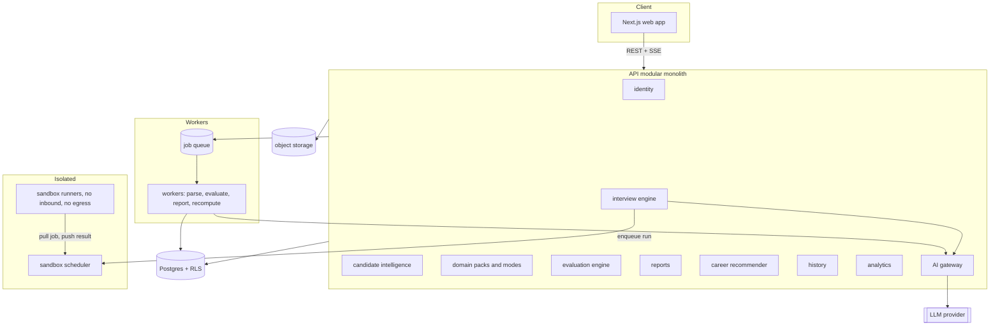

# AI Interview Platform: Architecture

Status: design only. No code exists yet. Stack defaults (TypeScript, Next.js, Fastify, Postgres/Supabase, Claude API) are proposals.

## 1. Central idea: domains are data, behavior is a small set of kinds

No career logic lives in code. Two layers separate what varies from what does not.

- **Domain Pack** (data). A versioned bundle of rows describing one career domain: competencies, rubrics, question templates, skill taxonomy, role catalog, mode definitions. Engineering, MBA, Finance, Marketing, Consulting and Data are six packs. A future domain is a new pack, with no deploy.
- **Interaction Kind** (code). A small closed set of interface behaviors the engine knows how to run: `conversation`, `coding`, `case`, `quant`, `document`, `whiteboard`. A kind is generic. "Consulting case interview" is a mode that uses kind `case` with consulting content. "System design" is a mode that uses `whiteboard`. A new kind is rare and is a code plugin. A new domain or mode is not.

An **Interview Mode** is a declarative spec: an ordered list of stages, each naming a kind, a question source, a rubric, limits and a scoring weight. The engine interprets it. Nothing branches on a domain name.

```jsonc
// mode_versions.spec
{
  "stages": [
    { "id": "intro",   "kind": "conversation", "questionSource": {"type":"generated","promptRef":"behavioral.v3"}, "rubricRef":"communication.v2", "maxTurns":3, "weight":0.2 },
    { "id": "core",    "kind": "coding",       "questionSource": {"type":"bank","tags":["arrays"],"difficulty":"medium"}, "rubricRef":"code-quality.v1", "timeLimitSec":2400, "weight":0.5 },
    { "id": "wrapup",  "kind": "conversation", "questionSource": {"type":"generated","promptRef":"followup.v1"}, "rubricRef":"communication.v2", "weight":0.3 }
  ],
  "adaptivity": { "difficultyStep": 1, "minScoreToRaise": 0.75 }
}
```

Adding "Marketing campaign critique" means inserting a mode whose stages use `case` or `document` with marketing rubrics and questions. No engine change.

## 2. System context and component boundaries



Module rules. Each module owns its tables and exposes a TypeScript interface. Other modules call the interface, never the tables. Cross-module reads of another module's data go through its interface or a read model. This keeps each module extractable later.

| Module | Owns | Does not do |
|---|---|---|
| identity | users, orgs, sessions, roles | any interview logic |
| catalog | domains, packs, competencies, rubrics, question bank, modes | run interviews |
| candidate intelligence | resumes, profiles, skills, skill evidence, readiness vector | choose questions |
| interview engine | sessions, stage runs, turns, state machine | score answers |
| sandbox | code submissions, run results | decide pass/fail meaning |
| evaluation | evaluations, competency scores, rubric application | conduct the interview |
| reports | rendered reports, trends | compute raw scores |
| career recommender | roles matched, gaps, learning paths, next sessions | evaluation |
| history | read model over past sessions | writes |
| analytics | event log, aggregates | PII-free by default |
| AI gateway | LLM calls, prompts, budgets, caching, logging | business rules |

## 3. Frontend architecture

- Next.js (App Router), React, TypeScript. Server components for dashboards, client components for the interview room.
- **Generic stage renderer.** The interview room reads the current stage's `kind` and mounts a component from a registry: `ConversationPane`, `CodeEditorPane` (Monaco), `CasePane` (prompt, exhibits, notes, structured answer), `QuantPane` (calculator, spreadsheet-like grid), `DocumentPane`, `WhiteboardPane`. The registry keys on kind, never on domain. A new kind is one registered component.
- Server state through TanStack Query. Interview stream through SSE with reconnect using a last-event id. Local draft autosave to IndexedDB, flushed to the API.
- Shared types and zod schemas from `packages/shared`. API client generated from the OpenAPI spec.
- Routes: `/onboarding`, `/resume`, `/practice` (pick domain, role, mode), `/session/[id]`, `/reports/[id]`, `/history`, `/careers`, `/settings`, and `/admin/packs` for pack authors.

## 4. Backend architecture

- Fastify API, modular monolith, one deployable. Request validation at the boundary only. Internal calls use typed values.
- Postgres is the source of truth. A job queue (pg-boss on Postgres to start, avoiding a new system) handles async work.
- **Interview engine** is a state machine per session.
  `created -> in_stage(n) -> awaiting_answer -> processing -> in_stage(n+1) -> completed | abandoned`
  Every transition is idempotent and keyed by `(session_id, seq)`. A retried request returns the stored result. The engine holds no in-memory state, so any API instance can serve any turn.
- **Question selection** is a pure function: `(stageSpec, candidateReadiness, history, bank) -> QuestionRef`. It samples from the bank by tags and difficulty, or asks the AI gateway to generate from a prompt template. It never reads the domain name.
- **Evaluation engine** applies a rubric to evidence. A rubric is data: criteria, anchored score levels, weight. Inputs are the answer, the question and any run results. Outputs are per-criterion scores with quoted evidence. Scoring runs async after each stage. The session completes without waiting on it, and the report waits for it.

## 5. Authentication and authorization

- Supabase Auth: email plus OAuth. API verifies the JWT. Tokens short-lived, refresh rotated.
- Authorization at two layers. API checks role and ownership. Postgres RLS enforces `user_id = auth.uid()` (or org membership) as a second wall, so an API bug cannot leak another user's rows.
- Roles: `candidate`, `org_member`, `pack_author`, `admin`. Pack authoring needs `pack_author`.
- Sandbox, workers and the AI gateway use service credentials scoped to the minimum tables. The sandbox gets none.

## 6. Resume processing and candidate intelligence

Pipeline (all async):

1. Upload to object storage with a presigned URL. Server checks type, size and a malware scan result.
2. Text extraction behind an `Extractor` port (PDF, DOCX, plain text; OCR fallback).
3. LLM structured extraction into a `ProfileDraft` (zod-validated). Resume text is wrapped as untrusted data in the prompt.
4. **Skill normalization** against the `skills` taxonomy (alias table, then embedding match with a confidence threshold). Unmatched skills are kept raw and queued for pack authors.
5. Write `profiles`, `profile_skills` (with source and evidence span), `experiences`, `education`.
6. **Readiness vector.** Per competency, a score and confidence, computed from three evidence streams: resume claims (low weight, unverified), interview evaluations (high weight), coding results (high weight). Decays with age. This vector is what question selection and the career recommender read. It is domain-agnostic because competencies are rows.

## 7. AI services

A single **AI gateway** is the only code that talks to the LLM provider.

- Typed tasks: `extractProfile`, `generateQuestion`, `followUp`, `scoreAnswer`, `summarizeReport`, `matchRoles`. Each task has a versioned prompt template, an output zod schema, a model choice and a token budget.
- Prompts are files in `packages/prompts`, referenced by `promptRef`. Domain packs reference prompts by name and pass variables. Pack authors can add prompts as data.
- Features: schema-validated output with bounded retry, timeouts, per-user and per-org budgets, response caching for deterministic tasks, full call log (prompt version, tokens, cost, latency, no raw PII by default).
- Prompt-injection posture. User text is passed as quoted data, never as instructions. Outputs are schema-validated, and no LLM output is ever executed or used as a SQL, shell or file path.
- Eval harness: a labeled set per task, run in CI when a prompt or model changes.

## 8. Coding execution sandbox

Threat model: the submitted code is hostile. Goals are no escape, no data theft, no network abuse, no resource exhaustion, no cross-user leakage, and no leak of hidden test cases.

**Topology.**
- The API never calls a runner. It writes a `run_jobs` row and enqueues.
- The **scheduler** is a small trusted service in a separate network segment. It leases jobs to runners.
- **Runners** run on dedicated hosts or a dedicated node pool, with no inbound connections. They pull jobs from the scheduler over an outbound-only authenticated channel and push results back. Compromising a runner gives no path to the API or database.

**Per-run isolation.** Each run gets a fresh microVM (Firecracker) or gVisor sandbox, destroyed after the run. Never reused between users or between runs.
- No network interface. No DNS.
- Read-only root filesystem from a prebuilt, pinned image per language. A small tmpfs working directory, size-capped.
- Non-root user, all capabilities dropped, seccomp allowlist, no ptrace, no mount.
- cgroup limits: CPU time, wall time, memory, PIDs, open files, disk, stdout/stderr bytes. Exceeding any limit kills the run with a distinct status.
- Compile step and run step are separate sandboxes with separate limits.
- No environment secrets, no cloud metadata endpoint reachable, no shared volumes.

**Hidden tests.** A trusted **harness outside the sandbox** feeds each test input to the user program over stdin and compares stdout. User code only ever sees inputs for the test currently running, never expected outputs and never the test list. For function-style problems the harness wrapper lives in the trusted layer and the sandbox returns serialized output only.

**Results.** Runner returns `{status, per_test: {passed, timeMs, memKb}, stdout (truncated), stderr (truncated)}`. The scheduler signs the result with a key the API verifies. Output is treated as untrusted text when rendered (escaped) and when given to the LLM.

**Abuse controls.** Per-user rate limits and concurrency caps, per-org quotas, queue depth limits, a kill switch, and alerts on timeouts, OOMs and anomalous syscalls. Submitted source is stored with a size limit.

**Languages.** Start with Python and JavaScript. Adding one is a new image plus a row in `languages`, not a code change in the engine.

## 9. Performance reports, history, analytics

- **Report** = a materialized document built from the evaluation: overall score, per-competency scores with quoted evidence, per-stage breakdown, strengths and gaps, trend versus prior sessions in the same domain, and recommended next practice. The narrative is LLM-written from structured scores only, so it cannot invent scores.
- **History** is a read model: a denormalized `session_summaries` table updated when a session completes. Listing and filtering never touches turns.
- **Analytics** is an append-only `events` table (`session_started`, `stage_completed`, `evaluation_ready`, ...) with no free text. Aggregates are computed by scheduled jobs into rollup tables. Pack authors see per-question difficulty and discrimination, which feeds pack quality.

## 10. Career recommendation engine

- Inputs: readiness vector, target role requirements, skill taxonomy.
- `roles` carry `role_requirements` (competency, minimum level, weight), so matching is arithmetic over data. Same code for every domain.
- Output: ranked role matches with a fit score and explanation, the largest competency gaps, a learning path (ordered `resources` linked to skills), and the next recommended `mode` to practice. The LLM may phrase explanations, but the ranking comes from the numbers.

## 11. Database schema

Postgres. `id uuid primary key default gen_random_uuid()`, `created_at timestamptz` on every table unless noted. Versioned content tables are immutable once published. Sessions pin the exact version they ran.

**Identity**
- `users(id, email, display_name, locale)`, `orgs(id, name)`, `org_members(org_id, user_id, role)`

**Catalog (the extensibility layer)**
- `domains(id, slug, name, status)`
- `packs(id, domain_id, slug, name)` and `pack_versions(id, pack_id, version, published_at, content_hash)`
- `competencies(id, pack_version_id, slug, name, description, parent_id)`
- `rubrics(id, pack_version_id, slug, version)` and `rubric_criteria(id, rubric_id, competency_id, name, weight, levels jsonb)`  // levels: anchored descriptors per score
- `question_templates(id, pack_version_id, kind, tags text[], difficulty smallint, body jsonb, rubric_id)`
- `modes(id, pack_id, slug, name)` and `mode_versions(id, mode_id, version, spec jsonb, published_at)`
- `skills(id, slug, name)` and `skill_aliases(skill_id, alias)`, `skill_competencies(skill_id, competency_id, weight)`
- `roles(id, domain_id, slug, name)` and `role_requirements(role_id, competency_id, min_level, weight)`
- `resources(id, title, url, skill_id, level)`
- `languages(id, slug, image_ref, compile_cmd, run_cmd, limits jsonb)`

**Candidate**
- `resumes(id, user_id, object_key, status, parsed_at)`
- `profiles(id, user_id, headline, summary, source_resume_id)`
- `experiences(id, profile_id, org, title, start, end, description)`, `education(...)`
- `profile_skills(profile_id, skill_id, claimed_level, evidence jsonb, source)`
- `readiness(user_id, competency_id, score, confidence, updated_at)`  // the readiness vector

**Interview**
- `sessions(id, user_id, mode_version_id, target_role_id, status, started_at, ended_at, seed)`
- `stage_runs(id, session_id, stage_id, kind, idx, status, question_ref jsonb, started_at, ended_at)`
- `turns(id, stage_run_id, seq, actor, content jsonb, created_at, unique(stage_run_id, seq))`  // append-only; seq gives idempotency
- `code_submissions(id, stage_run_id, language_id, source, created_at)`
- `run_jobs(id, submission_id, status, lease_expires_at, attempts)` and `run_results(job_id, status, per_test jsonb, stdout, stderr, signature)`

**Evaluation and reporting**
- `evaluations(id, session_id, rubric_versions jsonb, model, prompt_version, overall, status)`
- `competency_scores(evaluation_id, competency_id, score, confidence, evidence jsonb)`
- `reports(id, evaluation_id, body jsonb, rendered_at)`
- `recommendations(id, user_id, evaluation_id, type, payload jsonb)`
- `session_summaries(session_id, user_id, domain_id, mode_slug, overall, finished_at, top_gaps jsonb)`  // history read model

**Platform**
- `events(id, user_id, name, props jsonb, at)`, `ai_calls(id, task, prompt_version, model, tokens_in, tokens_out, cost, latency_ms, ok)`, `audit_log(...)`

Key constraints. All user-owned tables get RLS on `user_id`. Catalog tables are read-only to candidates. `sessions.mode_version_id` is a hard FK to an immutable version, so old reports stay reproducible after a pack changes.

## 12. API structure

REST, JSON, OpenAPI-described, versioned under `/v1`. Streaming via SSE.

```
Auth       POST /auth/* (delegated to Supabase)   GET /me   DELETE /me

Catalog    GET  /domains                          GET /domains/{id}/roles
           GET  /domains/{id}/modes               GET /modes/{id}            (latest published spec)
Authoring  POST /packs  POST /packs/{id}/versions  POST /pack-versions/{id}/publish   (pack_author)

Resume     POST /resumes                          -> presigned upload
           POST /resumes/{id}/complete            -> enqueue parse
           GET  /resumes/{id}                     GET /profile   PATCH /profile
           GET  /readiness

Interview  POST /sessions                         {modeId, targetRoleId}
           GET  /sessions/{id}                    GET /sessions/{id}/state
           POST /sessions/{id}/turns              {seq, content}   idempotent on seq
           GET  /sessions/{id}/events             SSE: question, token, stage_change, done
           POST /sessions/{id}/end

Coding     POST /stage-runs/{id}/submissions      {languageId, source}
           POST /submissions/{id}/run             (visible tests, rate limited)
           GET  /submissions/{id}/result          poll or SSE

Evaluation GET  /sessions/{id}/evaluation         202 until ready
           GET  /sessions/{id}/report

Careers    GET  /recommendations                  GET /roles/{id}/fit

History    GET  /history?domain=&mode=&from=&to=  GET /history/trends?competency=

Analytics  GET  /analytics/me                     (admin) GET /analytics/packs/{id}/questions
```

Rules. Every mutating call that can be retried takes an idempotency key or a sequence number. Errors use one problem+json shape. No endpoint accepts a domain name as a behavior switch. Domain appears only as a filter on catalog and history.

## 13. Data flows

**Resume to readiness.** Upload -> object storage -> `parse_resume` job -> extract text -> LLM extraction -> normalize skills -> write profile -> recompute readiness (resume stream only) -> event.

**Interview turn.**
1. Web `POST /sessions/{id}/turns {seq, content}`.
2. Engine loads session, pinned `mode_version`, current stage. If `seq` already stored, return the stored result.
3. Append the turn. Stage handler for the stage's `kind` decides: next follow-up, next question, or stage complete.
4. Follow-up text streams from the AI gateway over SSE.
5. On stage complete, enqueue `evaluate_stage`.
6. Last stage complete sets session `completed` and enqueues `finalize_evaluation`.

**Coding stage.** Submit -> `run_jobs` row -> scheduler leases to a runner -> runner executes in a fresh sandbox, harness compares outputs -> signed result back -> API verifies signature, stores `run_results`. Final submission also goes to `evaluate_stage` with test results as evidence.

**Evaluation to report.** `evaluate_stage` jobs write `competency_scores` -> `finalize_evaluation` aggregates by rubric weights -> writes `evaluations` -> updates `readiness` -> builds `reports` -> updates `session_summaries` -> `recommend` job -> events.

## 14. Security boundaries

| Boundary | Trust change | Controls |
|---|---|---|
| Browser to API | untrusted to semi-trusted | JWT, CORS, CSRF for cookies, schema validation, rate limits |
| API to Postgres | app to data | RLS as second wall, least-privilege DB roles, no raw SQL from user input |
| API to object storage | uploads | presigned URLs, size/type limits, malware scan, files never served from the API origin |
| API to LLM | data leaves | AI gateway only, PII minimization, no secrets in prompts, retention terms checked, schema-validated outputs |
| User text to prompts | injection | quoted data framing, no tool use on user text, outputs never executed |
| API to sandbox | trusted to hostile | queue only, no direct call, signed jobs and signed results, separate network and credentials |
| Sandbox internals | hostile code | microVM/gVisor, no network, seccomp, cgroups, read-only root, ephemeral per run |
| Pack authoring | content injection | `pack_author` role, review before publish, content rendered escaped, prompts versioned |
| Admin and analytics | privilege | audit log, aggregates without free text |

Cross-cutting. Secrets in a secret manager, never in the repo. Dependency and image scanning in CI. Data deletion and export for users. Retention windows for resumes and transcripts. Logs scrub resume text and source code by default.

## 15. Performance and scaling

- Stateless API instances behind a load balancer. Scale on request rate.
- Workers scale on queue depth. Sandbox runners scale on `run_jobs` backlog, with a warm pool of pre-booted microVMs to cut start latency.
- Interview latency budget. First token of a follow-up under 2 seconds, which is why evaluation is off the hot path.
- Indexes on `turns(stage_run_id, seq)`, `sessions(user_id, created_at)`, `session_summaries(user_id, finished_at)`, `question_templates(pack_version_id, kind, difficulty)` and a GIN index on `tags`.

## 16. Open decisions (need an owner)

1. Sandbox technology, Firecracker vs gVisor. Firecracker is stronger isolation and needs bare-metal or nested-virt hosts. gVisor runs on ordinary nodes. Recommendation is gVisor first behind a `Sandbox` interface, then Firecracker if the threat model grows.
2. Which interaction kinds ship in v1. Recommendation is `conversation` and `coding`, then `case` and `quant` to prove the kind system serves MBA, Consulting and Finance.
3. Who authors packs. Internal team only at launch, or customers too. This decides how much review tooling the authoring path needs.
4. Voice interviews are out of v1. They would add a `voice` transport on top of `conversation`, not a new domain concept.

## 17. Extensibility check

Walkthrough of adding "Product Management" as a domain. Insert a `domain`, a `pack_version` with competencies (product sense, prioritization), rubrics, question templates of kind `case` and `conversation`, a role set, and one mode spec. Publish. The UI lists it, the engine runs it, evaluation scores it, and recommendations include it. No code or schema change. If a PM mode needs a new interface (for example a PRD editor), that is a new kind, a single plugin plus one frontend component.
