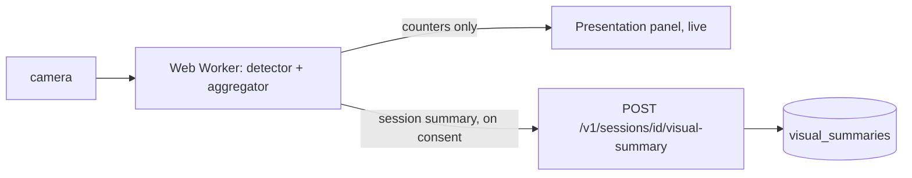

# Optional Visual Analysis: Design

Status: design only. Extends `docs/architecture.md`. Nothing here is implemented.

## 1. Principles

1. **Off by default, opt-in per session.** No camera access is requested until the candidate turns it on, and turning it off mid-session stops capture immediately.
2. **On-device only.** Frames are processed in the browser. No video, image or landmark stream is sent to the server, stored, or given to an LLM.
3. **Minimum signals.** Only signals that are observable geometry or availability, never inferred mental states.
4. **Feedback, never scoring.** Visual output does not enter the evaluation, readiness vector, role fit, history ranking or any hiring-facing view. It appears only in a private "presentation" panel of the candidate's own report.
5. **No claims we cannot support.** No emotion, personality, truthfulness, confidence, stress, intelligence, or protected-characteristic inference. The UI says what was measured and its limits.
6. **No camera is never penalized.** A session without video is a full session.

## 2. Signals

| Signal | What is measured | Method | Claim we make |
|---|---|---|---|
| Camera availability | Device present, permission state, stream live | `getUserMedia` status and track events | "Your camera was available / unavailable" |
| Face presence | Fraction of sampled frames with a face detected | On-device face detector | "Your face was in frame for 92% of the session" |
| Framing | Face box size and offset from center; too dark / too bright frame | Detector box plus mean luminance | "Your face was small / off-center / underlit" |
| Gaze-to-screen proxy | Coarse head orientation toward the screen (yaw/pitch within a wide band) | Head pose from landmarks, no iris tracking | "Your head was turned away from the screen for 18% of the time". Not "attention" or "engagement" |
| Movement steadiness | Variance of face box position over time | Box track | "Your camera framing moved a lot", a presentation note about the frame |

Explicitly excluded: facial expression or emotion, eye contact at pixel level, micro-expressions, age, gender, ethnicity, health, attractiveness, voice-based inference, liveness or cheating judgments. Anything called "engagement" in the product is the head-orientation proxy above and is labeled as such.

## 3. Architecture



- A Web Worker samples at 2 to 5 frames per second, runs a small WASM/WebGL face landmark model (MediaPipe-class, shipped as a static asset, no remote inference), and discards each frame immediately after processing. No `canvas.toBlob`, no `MediaRecorder`, no frame buffers retained.
- The worker keeps running counters only: frames sampled, frames with a face, frames outside the head-orientation band, luminance histogram buckets, framing buckets.
- At session end, with a second explicit confirmation ("Save these 6 numbers to your report?"), the browser posts the aggregate summary. Declining discards it with the tab.
- The browser camera indicator stays visible, and the app shows its own persistent "Camera analysis on" badge with a one-click off.

## 4. Consent and controls

- **Consent record** (versioned text, timestamp, what is collected, retention). Granted per session, revocable any time. Without a record the API rejects summaries.
- First enablement shows what is measured, what is never measured, that nothing leaves the device except the numbers shown, and that it does not affect scores.
- Settings page: toggle default (off), view and delete saved visual summaries, withdraw consent.
- Account deletion removes summaries. Retention default is 90 days, then purged by a scheduled job.
- Organizations cannot enable it for a candidate. Only the candidate can.

## 5. Data model (additions)

```
visual_consents(id, user_id, session_id, text_version, granted_at, revoked_at)
visual_summaries(
  session_id pk fk, user_id, consent_id fk,
  sampled_frames int, face_present_pct numeric, facing_screen_pct numeric,
  framing jsonb,        -- {small_pct, off_center_pct, dark_pct, bright_pct}
  steadiness numeric,
  model_version text, created_at, expires_at)
```

No blobs, no embeddings, no landmarks, no per-frame timeline. RLS on `user_id`. The table is excluded from `session_summaries`, analytics rollups, `events` props and AI gateway inputs by construction (separate module, no foreign reads).

## 6. API (additions)

```
POST   /v1/sessions/{id}/visual-consent     {textVersion}          -> VisualConsent
DELETE /v1/sessions/{id}/visual-consent                             -> 204 (also deletes summary)
POST   /v1/sessions/{id}/visual-summary     VisualSummaryRequest    -> 201 (requires active consent)
GET    /v1/sessions/{id}/visual-summary                              -> VisualSummary | 404
DELETE /v1/me/visual-data                                            -> 204
```

The summary schema is closed (zod `.strict()`), range-checked, and rejects extra fields so a client cannot smuggle frames or free text.

## 7. Frontend

- `CameraAnalysisToggle` in interview setup (off by default), a small `PresentationPanel` in the room that shows live framing tips only, and a "Presentation" section in the report that is clearly separated from scores.
- Copy rules enforced in review: no words like confident, nervous, engaged, honest. Each metric shows a one-line definition and a limitation note, for example that head orientation depends on camera position and says nothing about attention.
- Accessible alternatives: nothing in the interview requires video; the panel is keyboard and screen-reader operable; reduced-motion respected.

## 8. Fairness, accuracy and risk controls

- Face detectors and pose models perform unevenly across skin tone, lighting, glasses, head coverings, facial differences, and camera quality. Because output never enters scoring, failure costs the candidate a wrong tip, not a wrong outcome.
- Release gate: evaluate face-presence recall and head-orientation error on a documented, consented evaluation set stratified by skin tone, lighting, eyewear, head covering and camera angle. Publish per-group error; do not ship if the worst-group recall is materially below the best group. State results and known limits in the in-app help.
- Cultural and disability differences in gaze and posture are real. The product does not define a "correct" way to look at a camera and tells candidates that.
- Misuse guard: the data is not exposed to organizations, exports, or the AI gateway. Adding any use of it in scoring requires a new design review and a new consent version.
- Legal review before launch in regions with biometric-data rules (face geometry can count as biometric data). Treat consent and local-only processing as necessary, not sufficient.

## 9. Testing

- Unit: aggregator math, closed-schema rejection of extra fields, consent required for summary POST, revocation deletes data.
- Privacy tests: assert no network request carries image data (Playwright request inspection while analysis runs), no frame retained after processing (memory snapshot check in a test build), summary is the only payload.
- Behavior: camera denied, camera unplugged mid-session, tab hidden, multiple faces (reports presence only, no identity), low light.
- Fairness evaluation as a repeatable script with a fixed dataset manifest, run before any model version change.

## 10. Phasing

1. Camera availability and framing tips only, live, nothing posted to the server. Lowest risk, useful alone.
2. Add face presence and head-orientation proxy with the consent record and summary endpoint.
3. Only after the fairness gate passes, expose the Presentation section in reports.

## 11. Open decisions

1. Model choice and license (MediaPipe Face Landmarker vs smaller detector-only model). Detector-only is enough for phases 1 and 2 and avoids landmark data entirely; recommended first.
2. Retention. 90 days default, or "until session deleted".
3. Whether phase 3 ships at all. The product is fine with phase 1 alone.
